# web-stack-implementation

Hello and welcome to the Web Stack Implementation proejct!

What is a Web Stack? It is is a group of software components, used to implement or set up various applications (for example, a website). The "stack" refers to the specific layered components (e.g. OS system, webserver, script interpreter, and database) which are built ontop of each other. One of the most popular web stacks include LAMP, which stands for Linux, Apache, MySQL, and PHP. The LAMP stack will be used for this project! 

## LINUX
### Setting up your virtual enviornment

In order to complete this project, it is necessary to set up a virtual enviornment. In order to achieve this, first, create a free [AWS account](https://aws.amazon.com/) and then create a virtual server using the Ubuntu Server OS. More details to come shortly!

You may be wondering, 'what is AWS'? Amazon Web Services (AWS) is the leading Cloud Service Provider in the world. AWS offers a wide variety of databases and services for different types of applications. This allows users to choose the right tool for the job while receiving the best cost and performance. 

AWS offers a Free Tier for newly registered account users. This enables users to try out some AWS services free of charge within certain usage limits. For this project, I utilized the [EC2 (Elastic Compute Cloud)](https://aws.amazon.com/ec2/features/) compute service, which is covered by the Free Tier!

Let's get started!

Begin by registering and setting up an [AWS account](https://portal.aws.amazon.com/billing/signup#/start) and following the directions on the screen. Once you have created your AWS account, navigate to the login page and type in your credentials.

Once you have signed-in to your AWS account, navigate to the top-right of the screen and select your preferred region (this region should be the closest area to your physical location).

After you have selected your region, navigate to the search bar and type in "EC2". Select the EC2 service that appears.

 Next, click on "Launch Instances".
 

 
 
  Now we are going to configure our EC2 instance! Select the Ubuntu Server 20.04 LTS (HVM) as the Amazon Machine Image (AMI).
  
  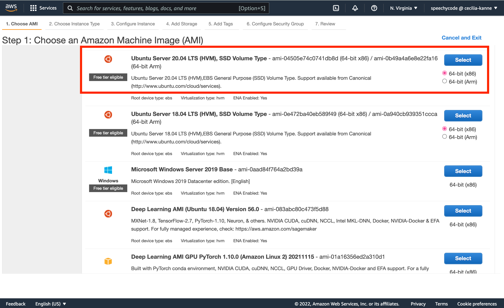
  

Then, select "t2.micro" as the instance type. Once you have made the selection, click "Review and Launch".

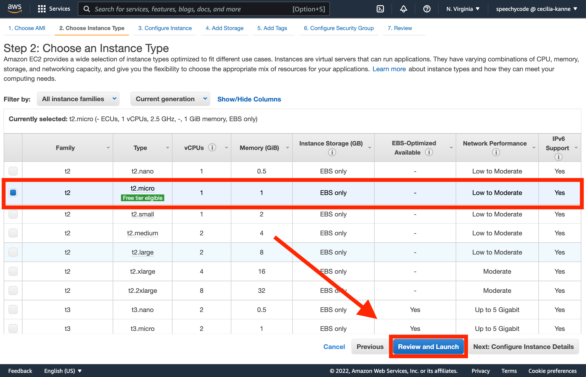

When you reach the "Review and Launch" page, click the "Launch" at the bottom-right of the page.

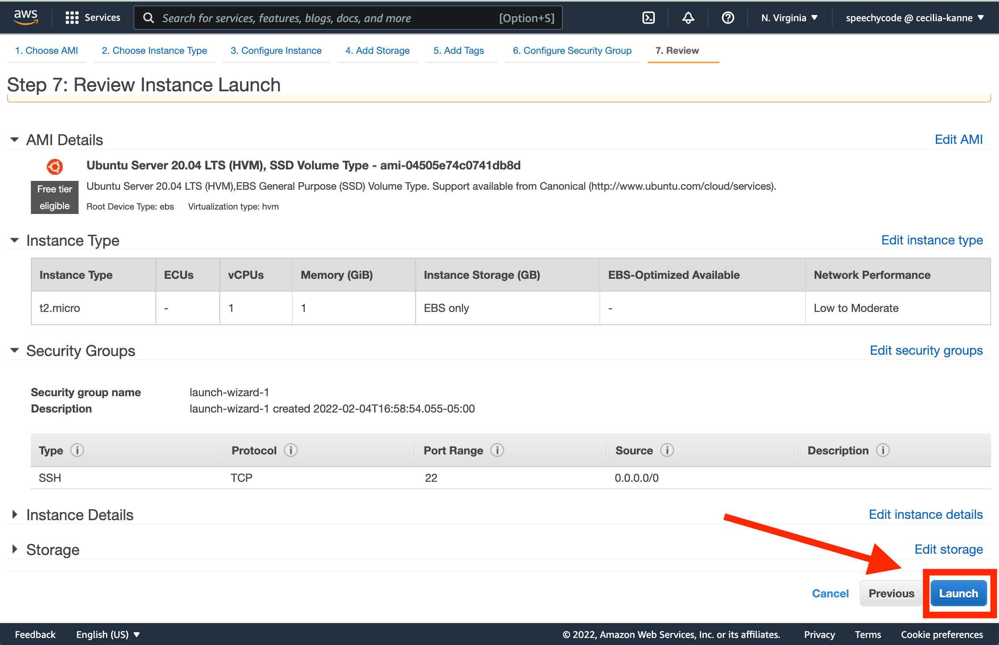

Next, you should see a window appear. Create a keypair and then select "download". Don't lose it! You will need this file in order to connect into your server from your local PC. After you downloaded the key pair, check the box for the acknowledgement, and then click on "Launch Instances".

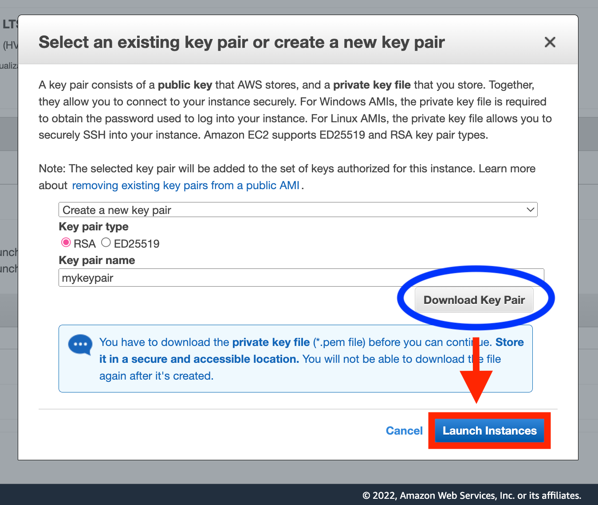

Great job! You've launched an EC2 instance! You can view your new instance by clicking the "View Instances" button at the bottom-left of your screen. Note: it may take a moment to initalize, so be patient!

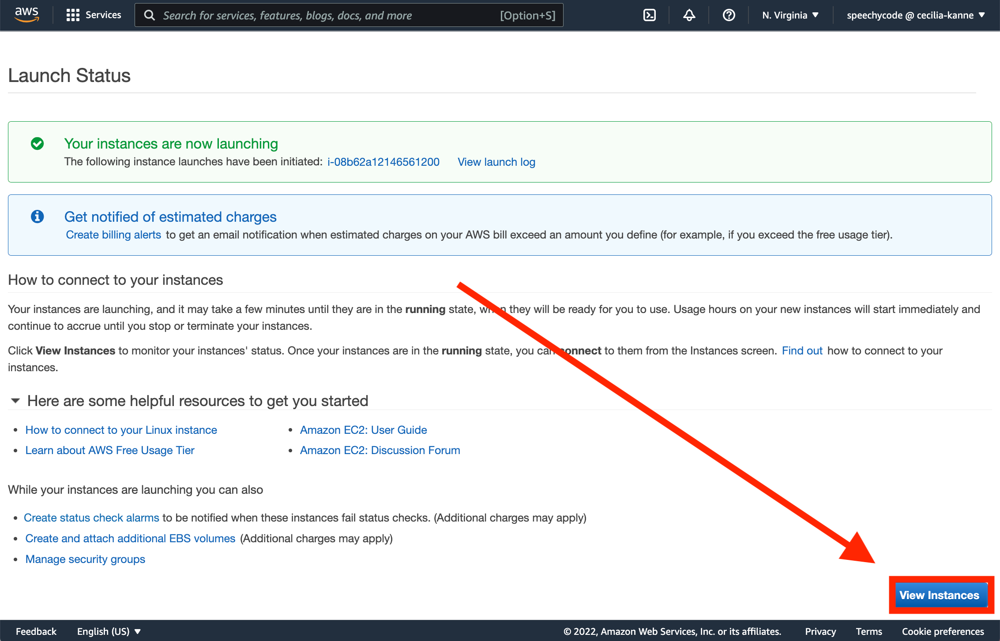

## Connecting to your EC2 from your local PC

**PLEASE NOTE** - Anchor tags **< >** will be used to indicate contents what must be replaced with your unique values. For example, if you have a file named **"keypair123.pem"** you must enter this information within the corresponding anchor tag: **< private-key-name >**

Now let's connect to our instance! 

Begin by opening Terminal. Once you have opened Terminal, use the `cd` command to change into the directory that your key pair is located. This is usually the `~/Downloads` directory. If you are having difficulty finding it, you can use the `ls` command to list the contents of your current directory.

Once you have located the keypair, use the command below to activate the key file (.pem). This command will also change premissions (otherwise you may get the error “Bad Permissions”). 

`$ sudo chmod 0400 <private-key-name>.pem`

When prompted, type the password for your local PC and press Enter on your keyboard.

Next, go back to the AWS console for a moment, and navigate to your running EC2 instance. Copy the Public IP address, as shown in the image below:

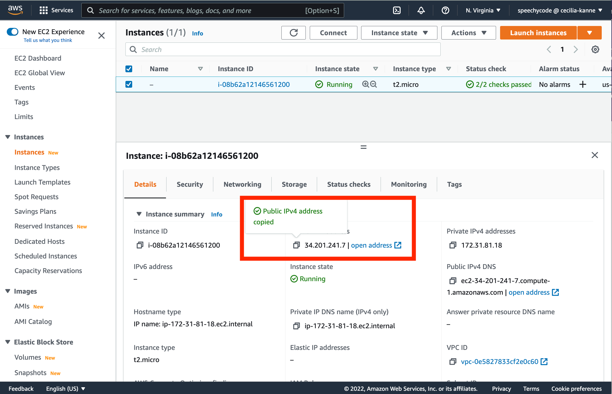

Now that you've copied the Public IP address, go back to Terminal. Connect to the EC2 instance by using the command below:

`$ ssh -i <private-key-name>.pem ubuntu@<Public-IP-address>`

Next, you will be asked if you want to continue connecting. Type "Yes" and press Enter on your keyboard.

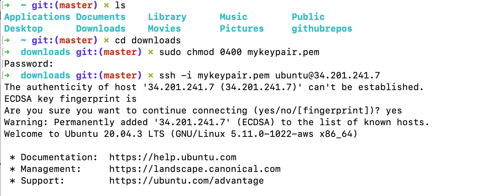

 To verify that you are connected, you should see your IP address on the top-right of the screen. Nice job! You have successfully connected to your Linux server in the Cloud enviornment.

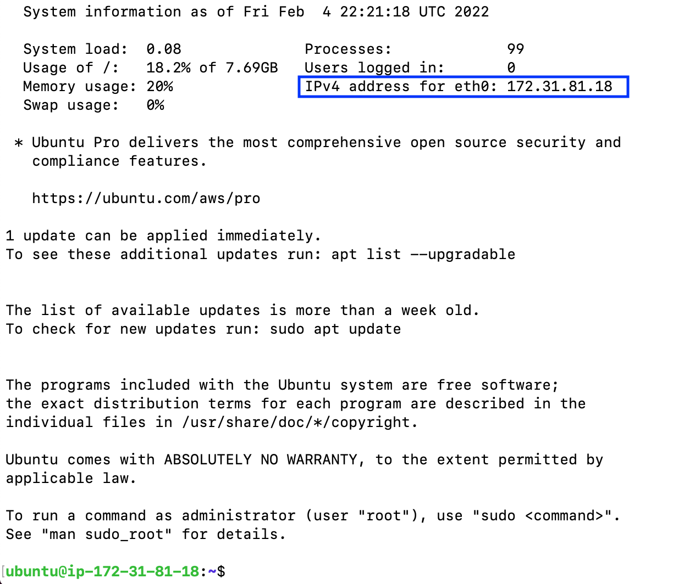

## APACHE
### Installing Apache on the virtual enviornment

What is Apache? **ADD DESCRIPTION**

Now we will install Apache using Ubuntu’s package manager: ***[‘apt’](https://guide.ubuntu-fr.org/server/apt.html))*** Begin by using the `$ sudo apt update` command to check for any available updates. 

Next, run the `$ sudo apt install apache2`command to run the Apache package installation. 

Terminal will generate a series of code. Once completed, you will see something like this:

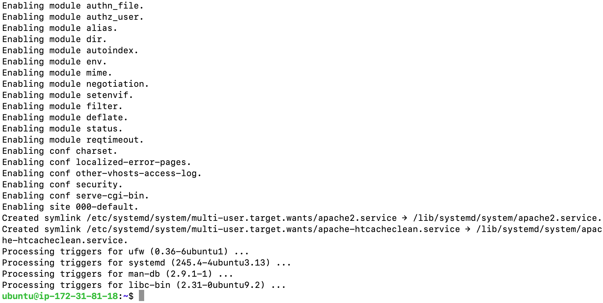

Once completed, use the following command to verify that Apache2 is running as a service in our OS: `$ sudo systemctl status apache2`

If there is a green dot, then that means it's running! Nice work!

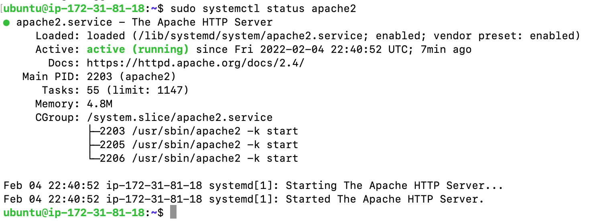

### Modifying The Firewall

In order to receive traffic to our Web Server, it is imperative to open TCP port 80. This is the default port that web browsers utilize in order to access web pages on the Internet.

When we created the EC2 instance on the AWS console,the TCP port 22 was opened by default. This allowed us to access the EC2 via SSH in Terminal. However, we must add a rule to the security groups of our EC2 configuration, in order to allow inbound connections through port 80.

Begin by navigating to your EC2 instance on the AWS Console. Click on the security group tab and edit the inbound rules of the running EC2 instance. 

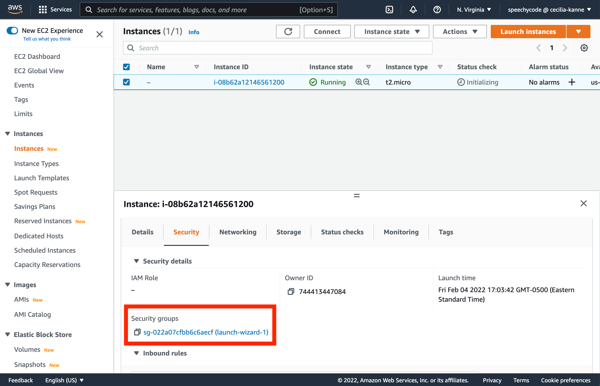

Next, click on "Edit Inbound Rules", as highlighted in the image below:

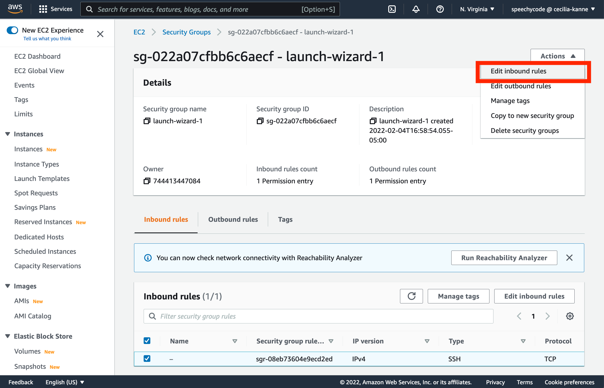

Next, click "add rule" and configure the inbound rules using HTTP as the protocol and 0.0.0.0/0 as the source, so that traffic from any IP address can enter. 

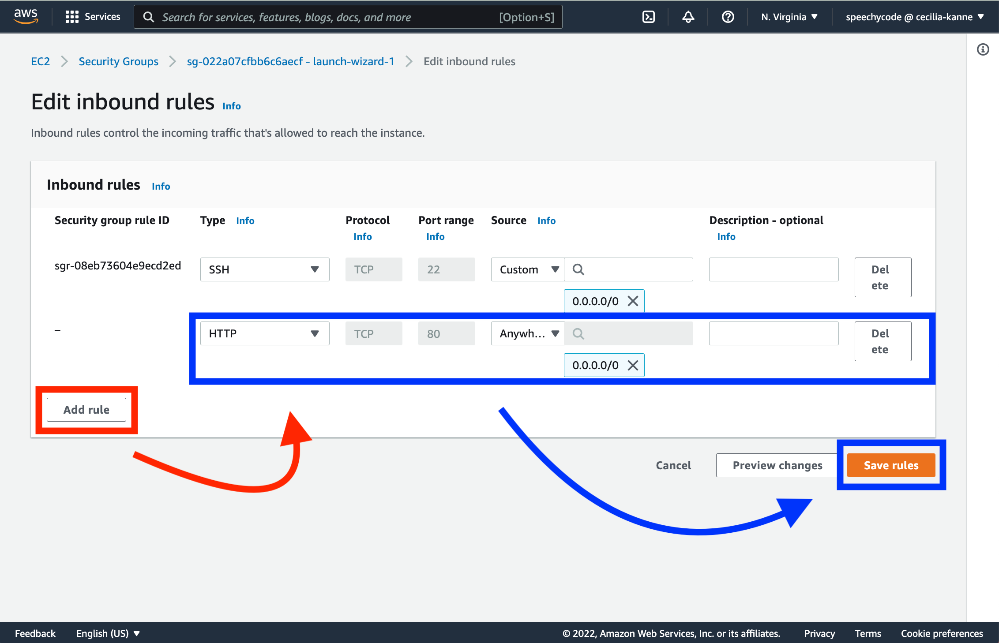

Now let's verify whether or not we can receive traffic. On the Terminal, use the `$ curl http://localhost:80` command to send a request the Apache HTTP Server on port 80. You should see something like this:

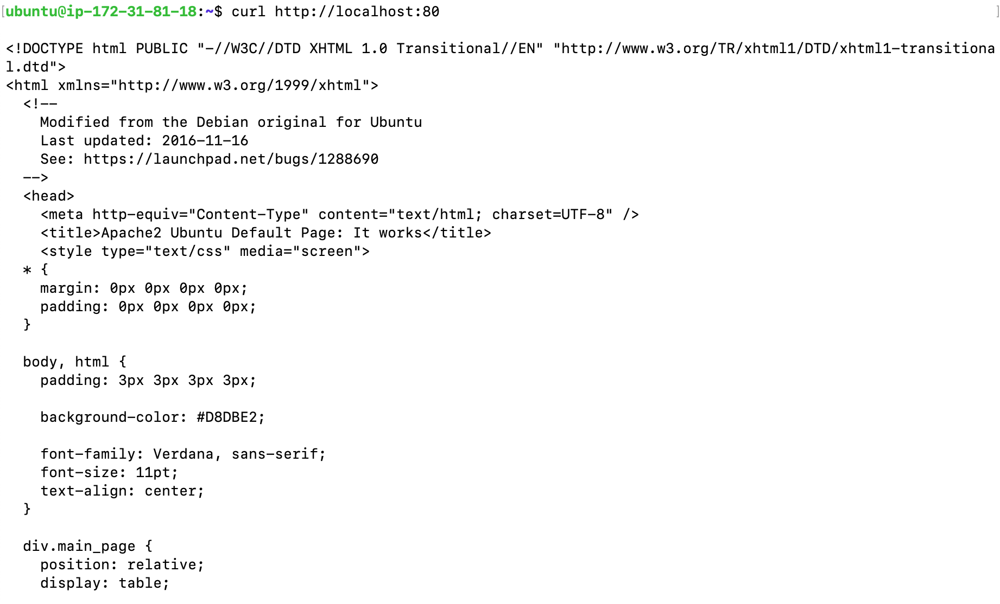

Next, let's try to verify access through the web browser using the public IP address of the EC2 instance. Open a web browser of your choice and then enter the following url (remember to replace contents within the Anchor tabs **< >**):

`http://<Public-IP-Address>:80`

You should see the following web page. This is the Apache2 Ubuntu Default page:

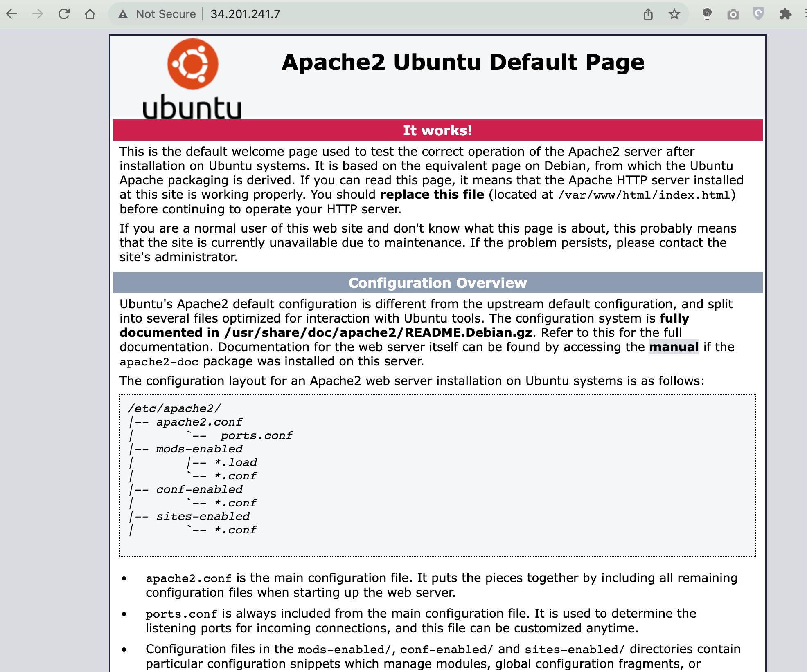

# MySQL
## Installing MySQL on the virtual enviornment

Congratulations on setting up and running your Apache web server. Next, we will install MySQL, which is an open-source relational database management system. This will allow us to store and manage data for the website.

Begin by using the following command to install MySQL:

`$ sudo apt install mysql-server`

When prompted, confirm that you want to proceed with the installation by typing `Y` for "Yes", and then press "Enter" on your Keyboard.

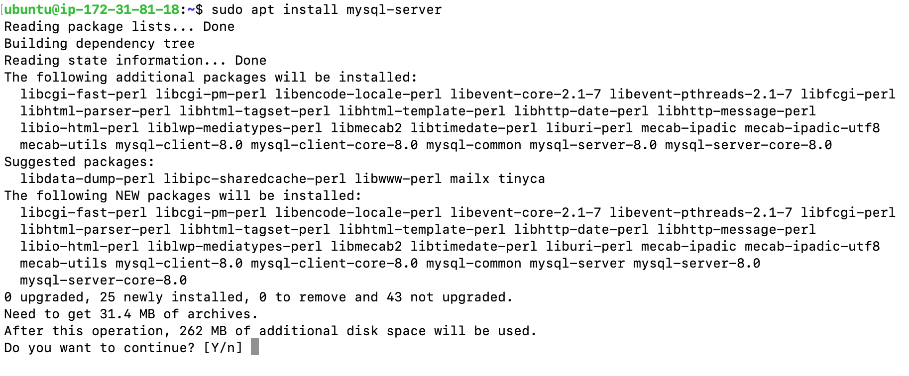

Once the installation is complete, it is best practice to   run a security script in order to add more security access to your database system. Use the following command:

`$ sudo mysql_secure_installation`

You will be asked to validate password component. Type `Y` for "Yes". 

Next, you must choose the level of your password validation. There are three levels of password validation policy:

Please choose either `0` = LOW, `1` = MEDIUM or `2` = STRONG

**Please Note:**

`LOW --- Length >= 8`

`MEDIUM --- Length >= 8, numeric, mixed case, **and** special characters`

`STRONG --- Length >= 8, numeric, mixed case, special characters **and** dictionary file`

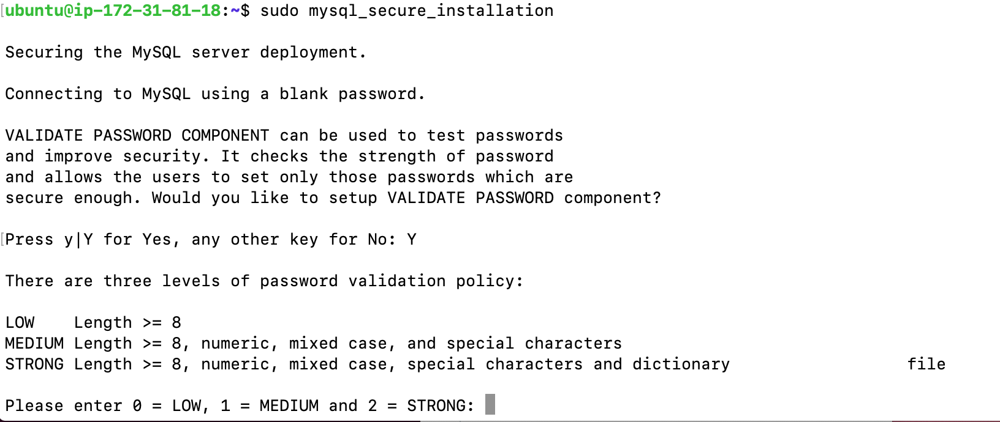

Once you are satisfied with your password, enter it then type `Y` for “yes” when asked if you want to continue with the password provided.

For the rest of the questions, type `Y` for "Yes" and press "Enter" on your keyboard at each prompt. 

These security measures will remove anonymous users and the test database, disable remote root logins, and then reload these new rules so that the changes will be reflected on the MySQL database. 

Your Terminal should look something like this:

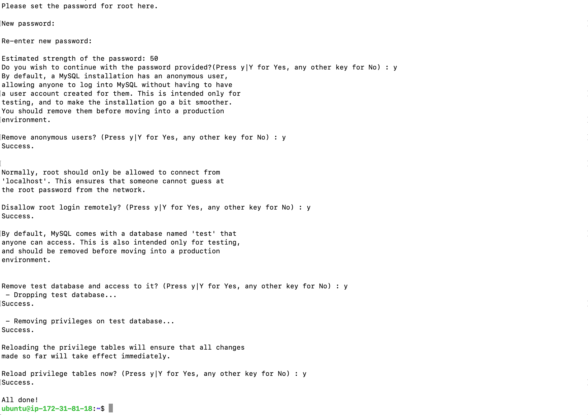

Next, you can check whether you can log in to the MySQL console by typing the following command. This command allows you to connect to the MySQL server as the administrative user (root user), which is implied by the use of 'sudo' part of the command:

`$ sudo mysql`

This will connect to the MySQL server as the administrative database user **root**, which is inferred by the use of sudo when running this command. You should see the following output:

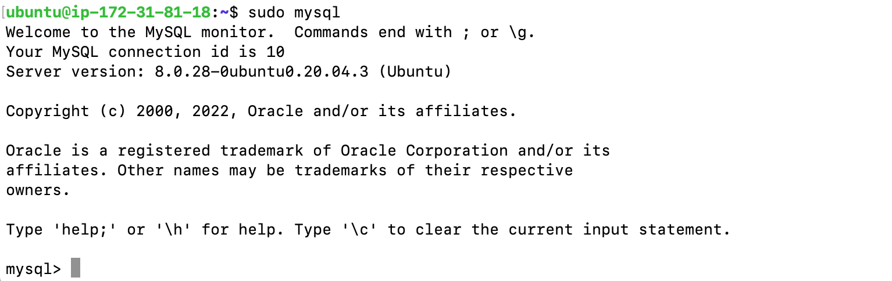

To exit the MySQL console, type the following:

`mysql> exit`

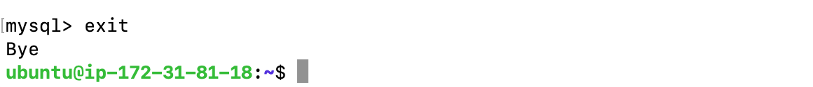

# PHP
## Installing PHP on the virtual enviornment

Congrats on making it this far! We have reached the final piece of the web stack; [PHP](https://www.php.net/) is general-purpose scripting language which process code so that it can display dynamic content to the end user. 

In addition to installing **PHP**, we must install **php-mysql**, which is a PHP module that allows PHP to communicate with MySQL-based databases. We must also install **libapache2-mod-php** to allow Apache to handle PHP files. 

In order to install all three of these packages at once, run the following command on Terminal:

`$ sudo apt install php libapache2-mod-php php-mysql`

Copy and paste the command: `sample code`

### **Step 1 - ABC...**