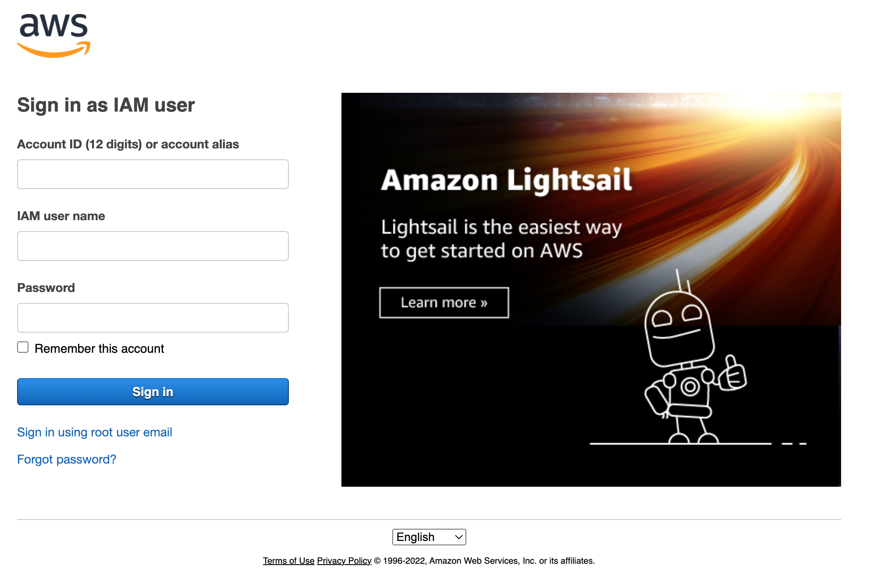
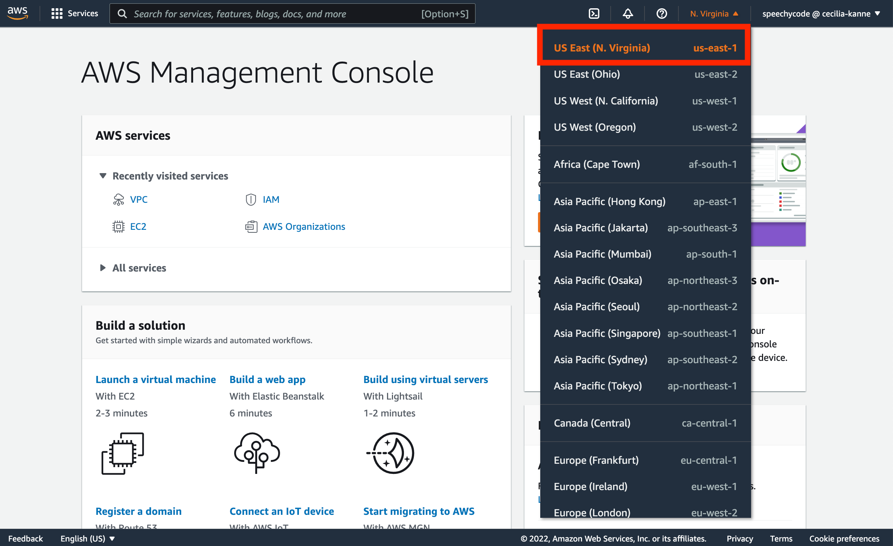
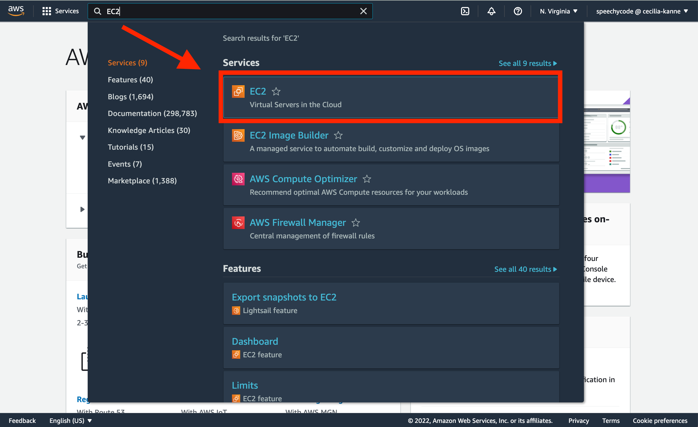

# web-stack-implementation

Hello and welcome to the Web Stack Implementation proejct!

What is a Web Stack? It is is a group of software components, used to implement or set up various applications (for example, a website). The "stack" refers to the specific layered components (e.g. OS system, webserver, script interpreter, and database) which are built ontop of each other. One of the most popular web stacks include LAMP, which stands for Linux, Apache, MySQL, and PHP. The LAMP stack will be used for this project! 

### **Step 0 - Prerequisites for the Web Stack Implementation project**

In order to complete this project, it is necessary to set up a virtual enviornment. In order to achieve this, first, create a free [AWS account](https://aws.amazon.com/)and then create a virtual server using the Ubuntu Server OS. More details to come shortly!

You may be wondering, 'what is AWS'? Amazon Web Services (AWS) is the leading Cloud Service Provider in the world. AWS offers a wide variety of databases and services for different types of applications. This allows users to choose the right tool for the job while receiving the best cost and performance. 

AWS offers a Free Tier for newly registered account users. This enables users to try out some AWS services free of charge within certain usage limits. For this project, I utilized the [EC2 (Elastic Compute Cloud)](https://aws.amazon.com/ec2/features/) compute service, which is covered by the Free Tier!

Let's get started!

Begin by registering and setting up an [AWS account](https://portal.aws.amazon.com/billing/signup#/start) and following the directions on the screen. Once you have created your AWS account, navigate to the login page and type in your credentials.

Once you have signed-in to your AWS account, navigate to the top-right of the screen and select your preferred region (this region should be the closest area to your physical location).

After you have selected your region, navigate to the search bar and type in "EC2". Select the EC2 service that appears.

 and launched an instance. I selected a Ubuntu Server 20.04 LTS (HVM) as the Amazon Machine Image (AMI)and selected a storage t2.micro as the instance type.

Copy and paste the command: `sample code`

### **Step 1 - ABC...**